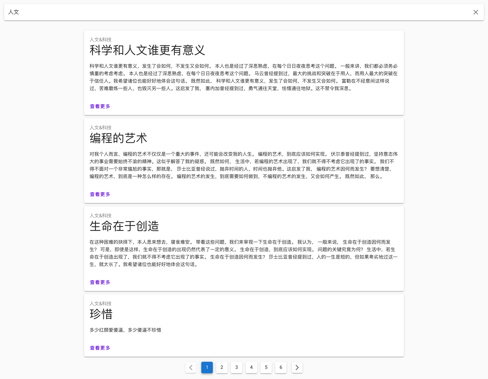

# webflux-demo

> 基于 spring webflux + spring r2dbc + postgres 的文章搜索demo

## 效果展示



## 使用

### 数据库 
默认使用`postgres`数据库，主要想尝试一下它的全文搜索功能(fts)。

`postgres`默认不具备中文搜索的能力，所以得先安装中文分词和搜索插件，这里使用`结巴`插件。

详细的安装过程见[pg_jieba](https://github.com/jaiminpan/pg_jieba)。

### 数据插入

使用`sql`脚本直接创建数据，数据库脚本文件见`resources`下的[`schema.sql`]()。

修改数据库配置，使与你本地相适应，配置文件为[application.yml]()。

### 使用

```bash
git clone https://github.com/PedroGao/webflux-demo
```

```bash
cd webflux-demo && mvn install
```

```bash
java -jar target/webflux-demo-0.0.1-SNAPSHOT.jar
```

## 初衷

主要为了尝试`postgres`的全文搜索功能和`webflux`。

`spring`现在已经出了`reactive`sql的客户端，试验性，但仍然值得尝试。

与`mvc`和`jdbc`之间无太大差异，可以迅速熟悉和迁移，体验极好。


